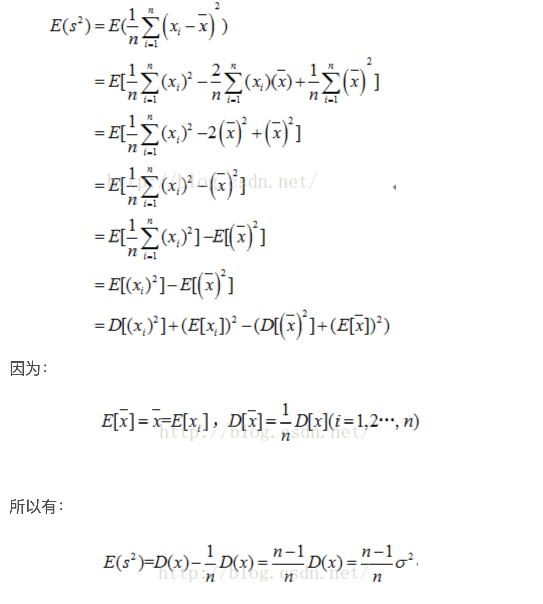

# 01 数理统计

[toc]

## 常用统计量

### 均值方差

### k阶样本原点矩

设 $X_1,X_2,...,X_n $ 是总体 $X$ 的一个简单随机样本，称
$$
A_k =  \frac{1} {n} {\sum_{i=1}^{n}X_i^k}
$$
为样本的 $k$ 阶原点矩（可以看到 $k=1$ 时，相当于样本均值），通常用样本的无阶原点矩来估计总体分布的 $k$ 阶原点矩。

### k阶样本中心矩

设 $X_1,X_2,...,X_n $ 是总体 $X$ 的一个简单随机样本，$\overline X$ 为样本均值，称
$$
M_k =  \frac{1} {n} {\sum_{i=1}^{n}(X_i-\overline X)^k}
$$
为样本的 $k$ 阶中心矩，通常用样本的 $k$ 阶中心矩来估计总体分布的 $k$ 阶中心矩。

其实当样本量足够大时，$1/n$ 与 $1/(n-1)$ 近似于相等。

**问题：为什么要使用n-1？**



### 顺序统计量


# 02 描述性统计

### 分位数

### 变异系数：

标准差/均值

- 是刻画数据相对分散性的一种度量。变异系数只在平均值不为零时有定义，而且一般适用于平均值大于零的情况。变异系数也被称为**标准离差率**或**单位风险**。

- 当需要比较两组数据离散程度大小的时候，如果两组数据的测量尺度相差太大，或者数据量纲的不同，变异系数可以消除测量尺度和量纲的影响。
  $$
  CV = \frac{s}{\bar{x}}*100\%
  $$
  

### 四分位差

样本上、下四分位数之差称为四分位差(或半极差)。
$$
R_1 = Q_3 - Q_1
$$
它也是度量样本分散性的重要数字特征，特别对于具有异常值的数据，它作为分散性具有稳健性。

# 03 常见分布

## 正态分布：

**正态分布**（normal distribution），也称高斯分布，是一个非常常见的连续概率分布。（中心极限定理）

 
$$
f(x) = \frac{1}{\sqrt{2\pi}\sigma}exp\{-\frac{(x-\mu)^2}{2\sigma^2}\}, \\
称X 服从 N(\mu ,\sigma^2) 分布
$$

### 偏度（skewness）

也称为偏态，是统计数据分布偏斜方向和程度的度量，是统计数据分布非对称程度的数字特征。直观看来就是密度函数曲线尾部的相对长度。**偏度刻画的是分布函数（数据）的对称性。**关于均值对称的数据其偏度系数为0，右侧更分散的数据偏度系数为正，左侧更分散的数据偏度系数为负。

1. **正态分布的偏度为0，两侧尾部长度对称。**
2. **左偏:**                       

- 若以bs表示偏度。bs<0称分布具有**负偏离**，也称左偏态；
- 此时数据位于均值左边的比位于右边的少，直观表现为左边的尾部相对于与右边的尾部要长；
- **因为有少数变量值很小，使曲线左侧尾部拖得很长；**

3.**右偏：**

- bs>0称分布具有**正偏离**，也称右偏态；
- 此时数据位于均值右边的比位于左边的少，直观表现为右边的尾部相对于与左边的尾部要长；
- **因为有少数变量值很大，使曲线右侧尾部拖得很长；**

公式：
$$
g1 = \frac{n}{(n-1)(n-2)s^3}\sum_{i=1}^n{(x_i-\bar{x})^3} = \frac{n^2\mu_3}{(n-1)(n-2)s^3}
$$

```python
s = pd.Series(data) 
print('偏度系数',s.skew())
```


### 峰度（peakedness;kurtosis）

**说明的是分布曲线在平均值处峰值高低的特征数。直观看来，峰度反映了峰部的尖度。样本的峰度是和正态分布相比较而言统计量，如果峰度大于三，峰的形状比较尖，比正态分布峰要陡峭。反之亦然。**峰度刻画的是分布函数的集中和分散程度。

公式：
$$
g2 = \frac{n（n+1）}{(n-1)(n-2)（n-3）s^4}\sum_{i=1}^n{(x_i-\bar{x})^4}-3\frac{(n-1)^2}{(n-2)(n-3)} \\= \frac{n^2(n+1)\mu_4}{(n-1)(n-2)(n-3)s^4}-3\frac{(n-1)^2}{(n-2)(n-3)}
$$

```python
s = pd.Series(data) 
print('峰度系数',s.kurt()) 
```

