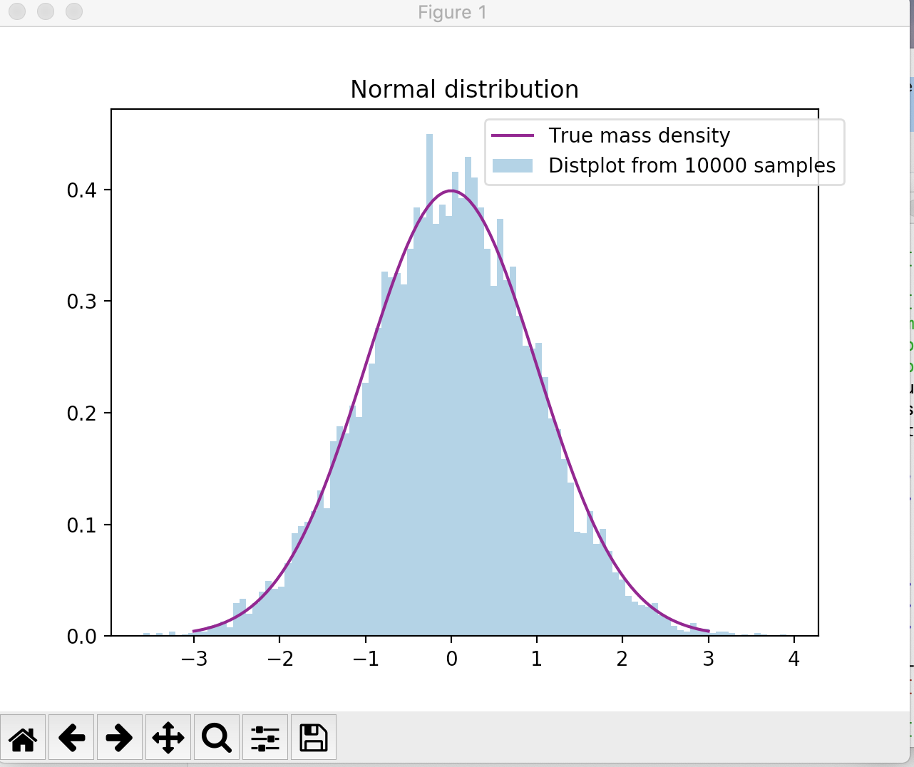
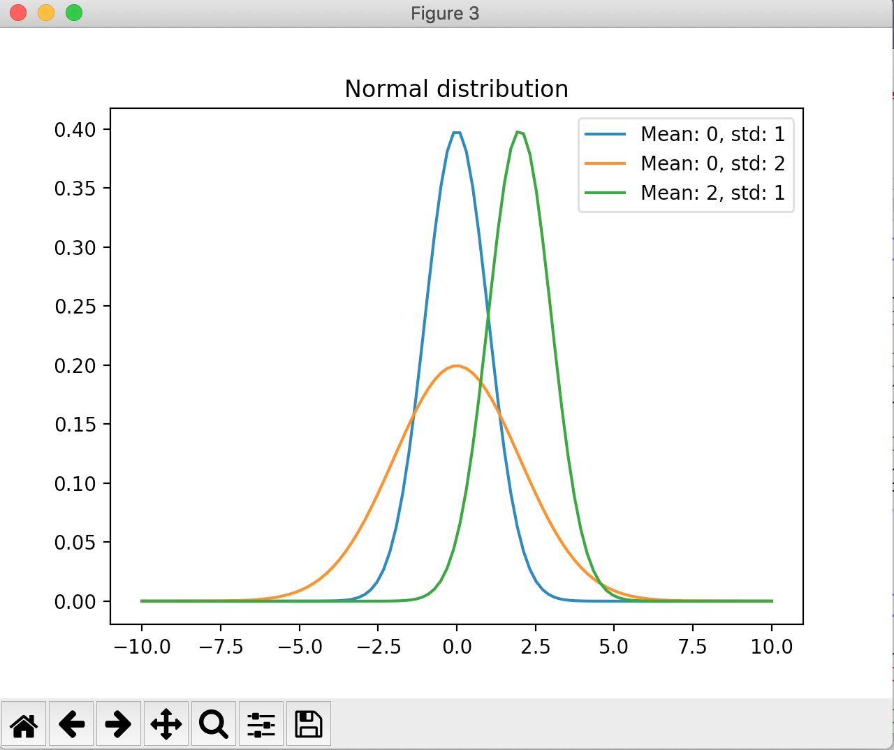

[toc]

# 01 常见分布

## 离散分布

离散型随机变量，使用概率质量函数（probability mass function），简称PMF，来描述其分布律。

### 二项分布（Binomial distribution）

放回取样，在n次试验中，单次试验成功率为p，失败率q=1-p，则出现成功次数的概率为
$$
P(X=x) = C_n^x p^x q^{n-x}
$$

```python
s = numpy.random.binomial(n=10,p=0.5,size=1000)
```


### 泊松分布（Poisson distribution）

具有比率参数（rate parameter）λ （λ=np）的一段固定时间间隔内，事件发生次数为i的概率为
$$
P\lbrace X= i \rbrace = e^{-λ} \frac{λ^i}{i!}
$$

```
s = numpy.random.poisson(lam=1,size=1000)
```


### 几何分布（Geometric distribution）

考虑独立重复试验，几何分布描述的是经过k次试验才首次获得成功的概率，假定每次成功率为p，
$$
P\lbrace X= n \rbrace = {(1-p)}^{n-1} p
$$


### 负二项分布（Negative binomial distribution）

考虑独立重复试验，负二项分布描述的是试验一直进行到成功r次的概率，假定每次成功率为p，
$$
P\lbrace X= n \rbrace = C_{n-1}^{r-1} p^r {(1-p)}^{n-r}
$$


### 超几何分布（Hypergeometric Distribution）

超几何分布描述的是在一个总数为N的总体中进行有放回地抽样，其中在总体中k个元素属于一组，剩余N-k个元素属于另一组，假定从总体中抽取n次，其中包含x个第一组的概率为
$$
P\lbrace X= n \rbrace = \frac {C_{k}^{x} C_{N-k}^{n-x}} {C_{N}^{n}}
$$


### 注意

### 注意

当n很大，p很小时，如*n* ≥ 100 and *np* ≤ 10时，二项分布可以近似为泊松分布。

当λ很大时，如λ≥1000时，泊松分布可以近似为正态分布。

当n很大时，np和n(1-p)都足够大时，如n ≥ 100 , np  ≥10，n(1-p) ≥10时，二项分布可以近似为正态分布。

## 连续分布

连续型随机变量，使用概率密度函数（probability density function），简称PDF，来描述其分布情况。通常还会用到累积分布函数 (cumulative distribution function)，简称CDF，来描述其性质，在数学上CDF是PDF的积分形式。

$$
PDF：P \lbrace a\leq X \leq b\rbrace = \int ^b_a f(x) {\rm d}x
$$


### 均匀分布 （Uniform distribution）

均匀分布指的是一类在定义域内概率密度函数处处相等的统计分布。

概率密度函数为
$$
f(x)=
\begin{cases}
\frac {1} {b-a} ,  &  a \leq x  \leq b \\
0, & others
\end{cases}
$$
分布函数为
$$
F(x)=\begin{cases}
0 ,  &  x< a \\
(x-a)(b-a), & a \leq x  \leq b \\
1, & x>b
\end{cases}
$$

```
s = numpy.random.uniform(low=0,high=1,size=1000)
```

```
scipy.stats.uniform.rvs(size=10)
```


### 正态分布 （Normal distribution）

也叫做高斯分布（呈钟形曲线），X ~ N(μ, $σ^2$) （μ为正态分布的均值，σ为正态分布的标准差）

概率密度函数为
$$
f(x)=\frac{1}{\sqrt{2π}\sigma}e^{\frac{-(x-u)^2}{2\sigma^2}}
$$
有了一般正态分布后，可以通过公式变换将其转变为标准正态分布 Z ~ N(0,1)，
$$
Z=\frac {X-μ} {σ} 
$$
中心极限定理与正态分布关系密切，中心极限定理说的是一组独立同分布的随机样本的平均值近似为正态分布，无论随机变量的总体符合何种分布。

```
s = numpy.random.normal(loc=0,scale=1,size=1000)
s = numpy.random.standard_normal(size=1000)
```


### 指数分布 （Exponential distribution）

指数分布通常被广泛用在描述一个特定事件发生所需要的时间，在指数分布随机变量的分布中，有着很少的大数值和非常多的小数值。

概率密度函数为
$$
f(x)=
\begin{cases}
λe^{-λx} ,  &   x  \geq 0 \\
0, & x < 0
\end{cases}
$$
记为 X~E（λ),   其中λ被称为率参数（rate parameter），表示每单位时间发生该事件的次数。

分布函数为
$$
F(a) = P\{X \leq a\} = 1-e^{-λa},  a\geq 0
$$
一个有趣的性质的是指数分布是无记忆性的，假定在等候事件发生的过程中已经过了一些时间，此时距离下一次事件发生的时间间隔的分布情况和最开始是完全一样的，就好像中间等候的那一段时间完全没有发生一样，也不会对结果有任何影响，用数学语言来表述是
$$
P\{X>s+t | X> t\} =P\{X>s\}
$$

```
s = numpy.random.exponential(scale=2,size=1000)
```


### $\Gamma$分布

常用来描述某个事件总共要发生n次的等待时间的分布

密度函数为


 特征函数为


### 威布尔分布 （Weibull distribution）

常用来描述在工程领域中某类具有“最弱链”对象的寿命

## Python 计算

scipy包

### PMF，PDF与CDF

```
from scipy import stats

# 计算二项分布B(10,0.5)的PMF
x=range(11)
p=stats.binom.pmf(x, n=10, p=0.5)

# 计算泊松分布P(1)的PMF
x=range(11)
p=stats.poisson.pmf(x, mu=1)

# 计算均匀分布U(0,1)的PDF
x = numpy.linspace(0,1,100)  # 在指定的间隔内返回均匀间隔的数字
p= stats.uniform.pdf(x,loc=0, scale=1)

# 计算正态分布N(0,1)的PDF
x = numpy.linspace(-3,3,1000)
p= stats.norm.pdf(x,loc=0, scale=1)

# 计算指数分布E(1)的PDF
x = numpy.linspace(0,10,1000)
p= stats.expon.pdf(x,loc=0,scale=1)

# 计算正态分布N(0,1)的CDF
x = numpy.linspace(-3,3,1000)
p = stats.norm.cdf(x,loc=0, scale=1)
```

### 可视化

```python
from scipy import stats
import matplotlib.pyplot as plt
import seaborn as sns
x=numpy.linspace(-3,3,100)
t= stats.norm.rvs(0,1,size=10000)
p=stats.norm.pdf(x, 0, 1)

fig, ax = plt.subplots(1, 1)
sns.distplot(t,bins=100,hist_kws={'density':True}, kde=False,label = 'Distplot from 10000 samples')

sns.lineplot(x,p,color='purple',label='True mass density')
plt.title('Normal distribution')
plt.legend(bbox_to_anchor=(1.05, 1))
```



```
x=numpy.linspace(-10,10,100)
p=stats.norm.pdf(x, 0, 1)
fig, ax = plt.subplots()
for  mean, std in [(0,1),(0,2),(2,1)]: 
        p=stats.norm.pdf(x, mean, std)
        sns.lineplot(x,p,label='Mean: '+ str(mean) + ', std: '+ str(std))
plt.title('Normal distribution')
plt.legend()
```



# 02 假设检验

假设检验问题时统计推断中的一类重要问题，在总体的分布函数完全未知或只知其形式，不知其参数的情况，为了推断总体的某些未知特性，提出某些关于总体的假设，这类问题被称为假设检验。

## 基本步骤

一个假设检验问题可以分为5步，无论细节如果变化，都一定会遵循这5个步骤。

1. 陈述研究假设，包含原假设（null hypothesis）和备择假设（alternate hypothesis） (通常来说，我们会把原假设的描述写成变量之间不存在某种差异，或不存在某种关联，备择假设则为存在某种差异或关联。)
2. 为验证假设收集数据(要求抽样的数据要具有代表性,可覆盖)
3. 构造合适的统计测试量并测试 （所有的统计检验都是基于组内方差和组间方差的比较，如果组间方差足够大，使得不同组之间几乎没有重叠，那么统计量会反映出一个非常小的P值，意味着不同组之间的差异不可能是由偶然性导致的。）
4. 决定是接受还是拒绝原假设（通常会以P=0.05作为临界值（单侧检验））
5. 展示结论

## 常用统计检验

### 回归检验

回归检验适用于预测变量是数值型的情况，根据预测变量的数量和结果变量的类型又分为以下几种。

|              |    预测变量    | 结果变量 |
| :----------: | :------------: | :------: |
| 简单线性回归 | 单个，连续数值 | 连续数值 |
| 多重线性回归 | 多个，连续数值 | 连续数值 |
| Logistic回归 |    连续数值    | 二元类别 |

### 比较检验

比较检验适用于预测变量是类别型，结果变量是数值型的情况，根据预测变量的分组数量和结果变量的数量又可以分为以下几种。

|                    |     预测变量     |       结果变量       |
| :----------------: | :--------------: | :------------------: |
|   Paired t-test    |    两组，类别    | 组来自同一总体，数值 |
| Independent t-test |    两组，类别    | 组来自不同总体，数值 |
|       ANOVA        | 两组及以上，类别 |      单个，数值      |
|       MANOVA       | 两组及以上，类别 |   两个及以上，数值   |

### 关联检验

关联检验常用的只有卡方检验一种，适用于预测变量和结果变量均为类别型的情况。

### 非参数检验

此外，由于一般来说上述参数检验都需满足一些前提条件，样本之间独立，不同组的组内方差近似和数据满足正态性，所以当这些条件不满足的时候，我们可以尝试用非参数检验来代替参数检验。

|        非参数检验         | 用于替代的参数检验 |
| :-----------------------: | :----------------: |
|         Spearman          |   回归和关联检验   |
|         Sign test         |       T-test       |
|      Kruskal–Wallis       |       ANOVA        |
|          ANOSIM           |       MANOVA       |
|  Wilcoxon Rank-Sum test   | Independent t-test |
| Wilcoxon Signed-rank test |   Paired t-test    |
|                           |                    |

## 两类错误

事实上当我们进行假设检验的过程中是存在犯错误的可能的，并且理论上来说错误是无法完全避免的。根据定义，错误分为两类，一类错误（type I error）和二类错误（type II error）。

- 一类错误：拒绝真的原假设

- 二类错误：接受错误的原假设

  

一类错误可以通过α值来控制，在假设检验中选择的 α（显著性水平）对一类错误有着直接影响。α可以认为是我们犯一类错误的最大可能性。以95%的置信水平为例，a=0.05，这意味着我们拒绝一个真的原假设的可能性是5%。从长期来看，每做20次假设检验会有一次犯一类错误的事件发生。

二类错误通常是由小样本或高样本方差导致的，二类错误的概率可以用β来表示，和一类错误不同的是，此类错误是不能通过设置一个错误率来直接控制的。对于二类错误，可以从功效的角度来估计，首先进行功效分析（power analysis）计算出功效值1-β，进而得到二类错误的估计值β。

一般来说这两类错误是无法同时降低的，在降低犯一类错误的前提下会增加犯二类错误的可能性，在实际案例中如何平衡这两类错误取决于我们更能接受一类错误还是二类错误。

## Python代码实战

### 正态检验

Shapiro-Wilk Test是一种经典的正态检验方法。

H0: 样本总体服从正态分布

H1: 样本总体不服从正态分布 

```python
import numpy as np
from scipy.stats import shapiro
data_nonnormal = np.random.exponential(size=100)
data_normal = np.random.normal(size=100)

def normal_judge(data):
	stat, p = shapiro(data)
	if p > 0.05:
		return 'stat={:.3f}, p = {:.3f}, probably gaussian'.format(stat,p)
	else:
		return 'stat={:.3f}, p = {:.3f}, probably not gaussian'.format(stat,p)

normal_judge(data_nonnormal)
normal_judge(data_normal)

```

上述输出：'stat=0.987, p = 0.460, probably gaussian'

### 卡方检验

目的：检验两组类别变量是相关的还是独立的

H0: 两个样本是独立的

H1: 两组样本不是独立的

```python
from scipy.stats import chi2_contingency
table = [[10, 20, 30],[6,  9,  17]]
stat, p, dof, expected = chi2_contingency(table)
print('stat=%.3f, p=%.3f' % (stat, p))
if p > 0.05:
	print('Probably independent')
else:
	print('Probably dependent')

```

上述输出：stat=0.272, p=0.873

Probably independent

### T-test

目的：检验两个独立样本集的均值是否具有显著差异

H0: 均值是相等的

H1: 均值是不等的

```python
from scipy.stats import ttest_ind
import numpy as np
data1 = np.random.normal(size=10)
data2 = np.random.normal(size=10)
stat, p = ttest_ind(data1, data2)
print('stat=%.3f, p=%.3f' % (stat, p))
if p > 0.05:
	print('Probably the same distribution')
else:
	print('Probably different distributions')
    
```

上述输出：stat=-0.686, p=0.501

Probably the same distribution

### ANOVA

目的：与t-test类似，ANOVA可以检验两组及以上独立样本集的均值是否具有显著差异

H0: 均值是相等的

H1: 均值是不等的

```python
from scipy.stats import f_oneway
import numpy as np
data1 = np.random.normal(size=10)
data2 = np.random.normal(size=10)
data3 = np.random.normal(size=10)
stat, p = f_oneway(data1, data2, data3)
print('stat=%.3f, p=%.3f' % (stat, p))
if p > 0.05:
	print('Probably the same distribution')
else:
	print('Probably different distributions')
```

上述输出：stat=2.722, p=0.084

Probably the same distribution

### Mann-Whitney U Test

目的：检验两个样本集的分布是否相同

H0: 两个样本集的分布相同

H1: 两个样本集的分布不同

```python
from scipy.stats import mannwhitneyu
data1 = [0.873, 2.817, 0.121, 0.945, 0.055, 1.436, 0.360, 1.478, 1.637, 1.869]
data2 = [-1.142, -0.432, -0.938, -0.729, -0.846, -0.157, -0.500, -1.183, -1.075, 0.169]
stat, p = mannwhitneyu(data1, data2)
print('stat=%.3f, p=%.3f' % (stat, p))
if p > 0.05:
	print('Probably the same distribution')
else:
	print('Probably different distributions')
```

上述输出：stat=2.000, p=0.000

Probably different distributions